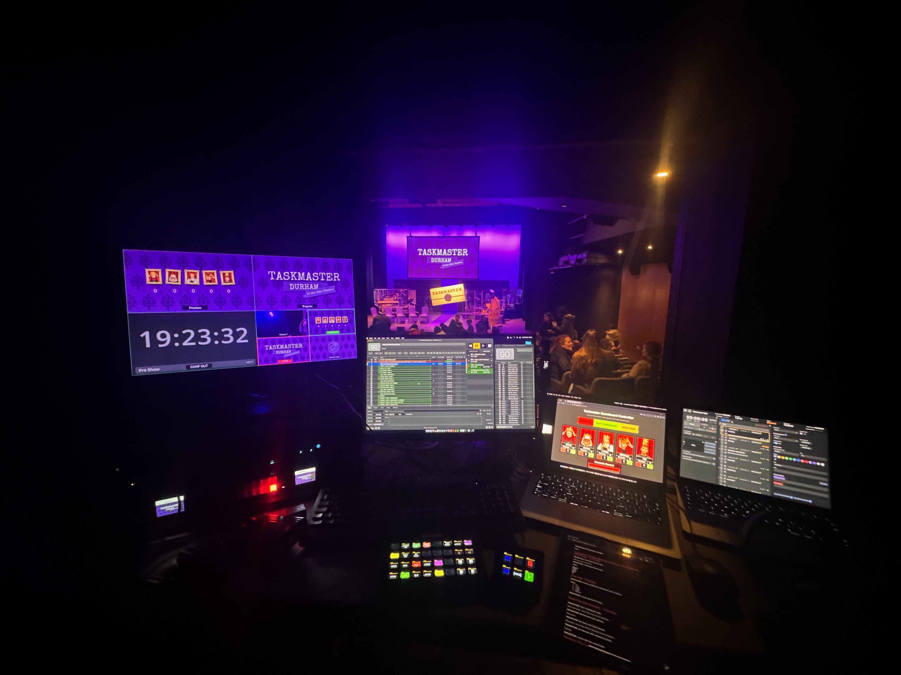
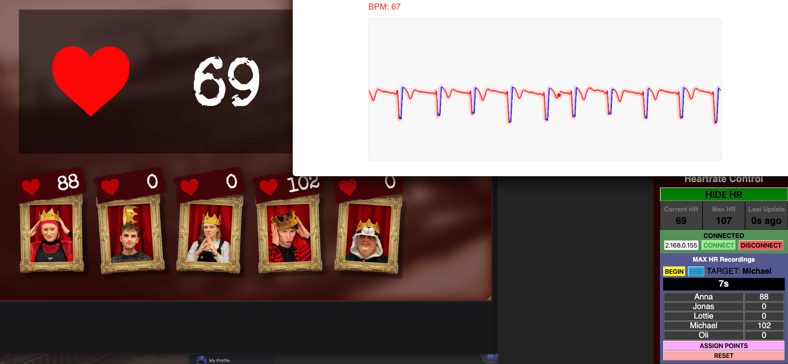
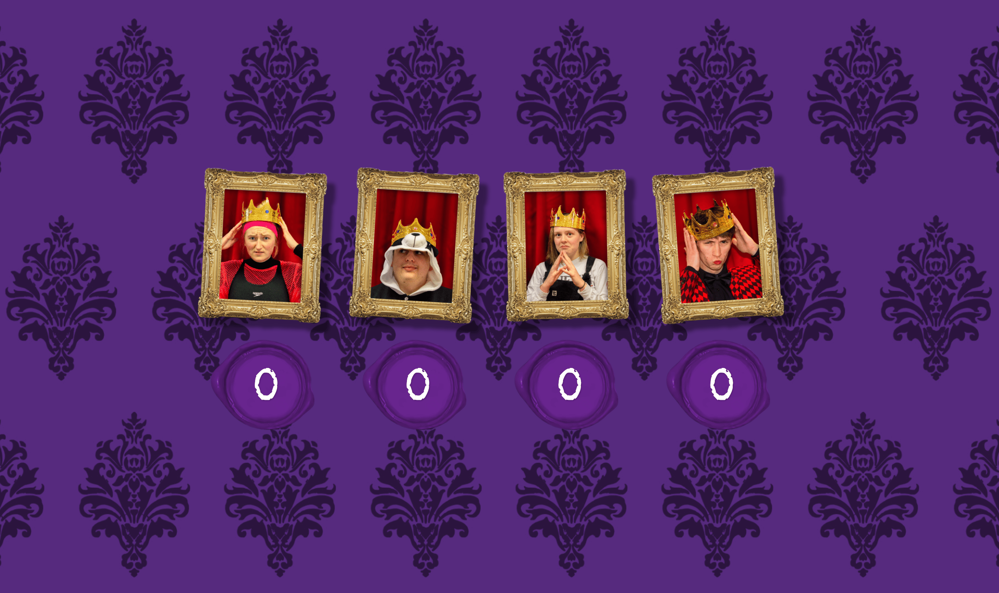
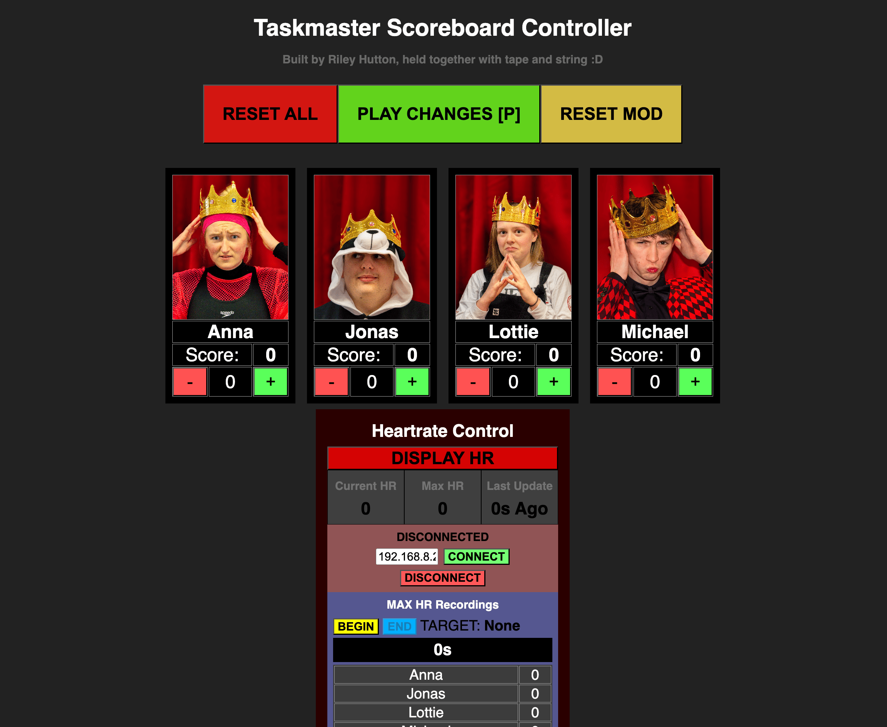

# Taskmaster Scoreboard with Live Heartrate

This is a fork of [VodBox's Taskmaster Scoreboard](https://vodbox.github.io/tm-scoreboard/) project, heavily modified to be suitable for use in live stage performances

> Taskmaster Scoreboard in use during a live performance - see Macbook screen (middle right) for controller and Multiview (top left) for scoreboard display.

## Key Features/Differences

- Clean "Display" page for audince facing output (no controls ever visible)
- "Control" page allowing complex score changes to be cued and run on command, without affecting scoreboard output
- Pre-defined player images and names (in json file)
- Live heartrate monitoring from ESP32 with ECG module

These features were designed with Ooook!'s 2025 Taskmaster performance. No server is required; the html pages can be run locally as long as they're in the same browser.

## Heartrate Streaming

The taskmaster's assistant is (comically) fitted with a 3-lead ECG connected to an [inexpensive ECG module](https://www.amazon.co.uk/Youmile-Module-Measurement-Monitoring-Arduino/dp/B08216YR9H/ref=sr_1_6_pp?crid=2AJFWO9LYY82T&dib=eyJ2IjoiMSJ9.kJCUFV_O9AS60XqNyo5G1UzkdFxBRdKyBgqrYCRrvJnT0zzJg5fKaU_4XcrZ87xGw087dokkEDABrYkYqRp8kGKlLOpUVrELG9jdK84Pdh9eQTD6a9uT36qTswgMok1cjGp-UOU03cs9Nf_weMqsb80d-QF-aZO9TMk__SFT-PWJ2MxV966xlzusvvRaLK_iwqRDqYd5ANfFok5jrAepJmyQY3PfJHLUBM8YhFhCD8220Kqitu2WolsYpvnuUIKOdu0sv8umbrc9B4Hw3W8KvvhJCvy0ZWbYjgYvkLAt24E.pZw04wuWNzG1VExEUbo4V3w0hNnnBLAROsIv33jJoLY&dib_tag=se&keywords=ecg+module&qid=1759951760&sprefix=ecg+modul%2Caps%2C119&sr=8-6) and ESP32 microcontroller. This setup livestreams ECG data and detected heart rate over the network to the control display via WebSocket. 

This custom solution was chosen over off-the-shelf alternatives (such as an Apple Watch with HypeRate) to allow full customization of the display appearance and provide instant results with precise control over data averaging and smoothing. This level of control is essential for capturing comedic moments, such as sudden heart rate spikes when a contestant, for example, waxes the leg of the wearer.

## Screenshots

